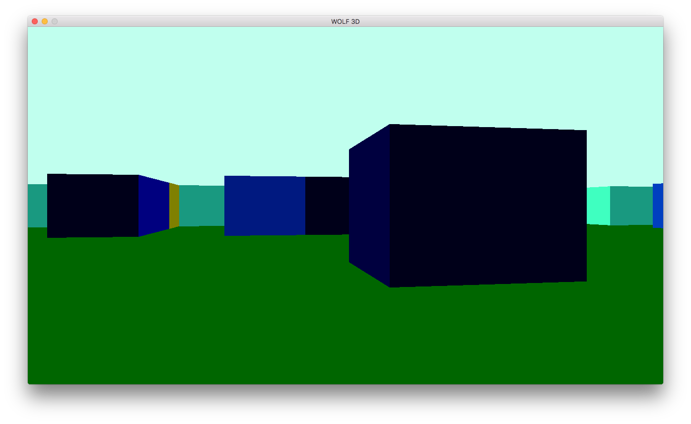
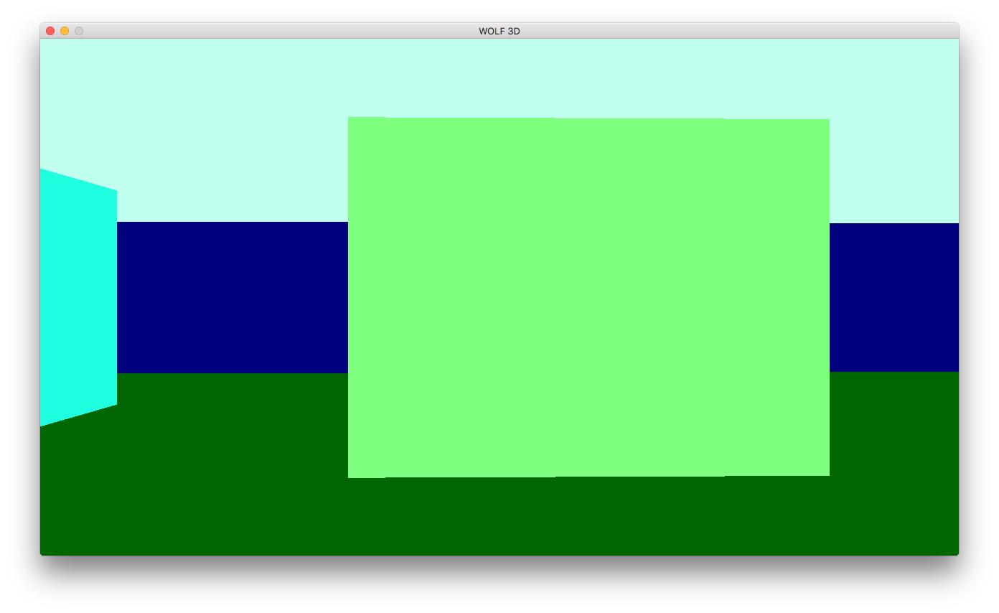
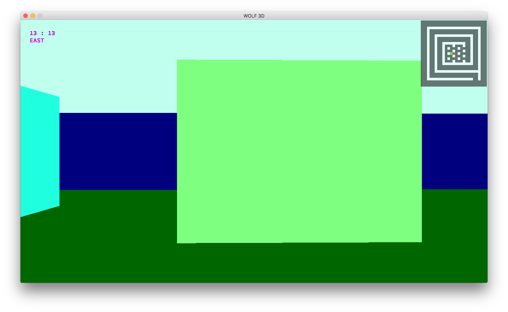

## Synopsis

**NOTE : It won't compile unless you uses MacOS system**

This program is a raycaster implementation, realized using the *"minilibx"*, a graphical library given by the 42 staff, and the *"libft"*, which is a reimplementation of some of the lib C functions.

## Usage

./wolf [map]

## How it works

Just build the program, using the makefile, then start it with one of the maps given in the "maps" directory.

**NOTE : Different maps are given in this directory, of different size (those datas can be found in the map.index file), but I didn't use memory allocation for it, so each time you want to use a map of a different size, you have to modify the values of *M_WIDTH* and *M_HEIGHT* in *includes/wolf.h* according to the map, and then recompile using *make re* (or *make re -s* if it is not the first time you compile). The default size is 100 * 100**

You can **move forward and backward**, using the *W and S* keys, you can **rotate** using the *A and D* keys. Finally, you can also **strafe** using the *Q and E* keys.

If you think you are moving to slow, you can just **sprint** using the *left shift* key.

Also, if you're lost, you could just print a **"compass"**, that will show you you're current position and the direction you're looking at, by pressing the *c* key. And if that's still not enough, you could then display a **minimap**, where the red dot is your position and the green dot is the direction you're looking at, by pressing the *m* key.

Finally, to **exit the program**, you could just press the *esc* key, or click the red cross on top left corner of the window.

## Screenshots

